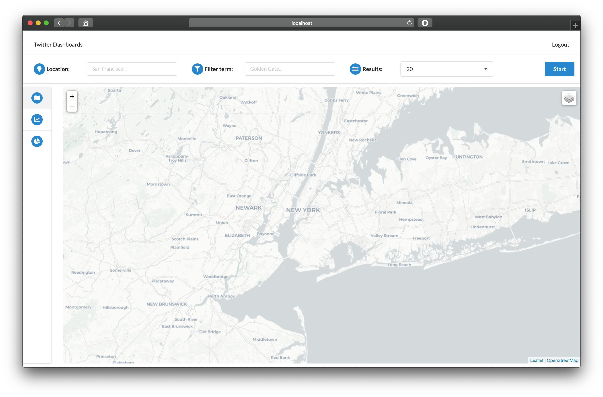

# Twitter dashboard client

<p align="center">
  
</p>

This project contains the Web dashboard front-end of a web application that displays _near real-time_ data over a socket.
It can be used in combination with the [Twitter dashboard server][dashboard-server] project to create a complete web application. 
Check the [video demo][video-demo] for context.

The goal is to represent near real time information in a map and a series of charts. Its visualization depends on
serving data with a given structure, as explained in the [Data structure section](#Data-structure).


## How does it work?

### Interface serving
The interface contents are served using a Node.js server once it is deployed (explained in the [Usage section](#Usage)).
That web server will respond HTTP request with a static interface, which has been dynamically built using React.

The usage of [React][react-webpage], [Semantic-ui][semantic-webpage] and [React-router][react-router], has been done 
to allow easy interface extensibility.


### Authentication

Given that this project was originally created to work with a [Twitter Streaming API][twitter-stream-api] data retriever back-end,
an authentication step was built in the interface. This step forces the user to perform a log-in in the official Twitter page,
obtaining two fields in return: `oauth_token` and `oauth_verifier`. This last one is used to obtain a _token_secret_,
which is stored in the corresponding backend.

From those two token values, the first one is locally stored in the user computer **using a cookie**, while the second one
is thought to be stored in the back-end, as it is use to start / stop a data stream when combining it with its cookie couple.


### Components integration
As clarified in the introduction, this is jut and interface, which **need to be integrated with a back-end**. The connected 
backend would need to have several connecting endpoints for the pieces to work together:

- `/login` POST endpoint to get the authentication redirect URL.
- `/token` POST endpoint to get the `twitter_account` and `twitter_token`. Arguments:
    - `oauth_token` String with the user token.
    - `oauth_verifier` String with the user verification code.
- `/startStream` POST endpoint to start the data stream. Arguments:
    - `twitter_account` String with the user account name.
    - `twitter_token` String with the user token.
    - `location` String describing the area to filter the data stream.
    - `filterWord` String describing the word to filter the data stream contents.
    - `maxResults` Integer indicating the number of simultaneous results **(not used)**.
- `/stopStream` POST endpoint to end the data stream.
- `/stream`: Socket endpoint to open a persistent channel (use your language favourite [SocketIO][socketio-webpage] client).


### Data communication
The data communication between a supposed back-end and this front-end client was designed to be done in an **asynchronous manner**,
meaning each time a _data point_ is retrieved by the back-end, it must be send over the open socket (allowing real-time visualization).

### Data structure
Each data point interchanged between back-end and front-end need to have the following structure:
```json
{
    "coords":  [123, -75],
    "label":   "neutral",
    "source":  "android",
    "text":    "This is just an example",
}
```

These JSON keys are needed to provide the interface current visualization capabilities: geo-location, sentiment comparison,
and device source comparison. **Additional JSON keys could be added** to provide further functionality.


## What is in the repository?
The code organization has been inspired by the _[How to better organize your React applications?][medium-post]_ 
post by Alexis Mangin. From there, the folder structure has been defined as follows:

```yaml
/public: web server basic info.
/src:
    # Files
    config.js: global React configuration
    index.js: interface routes definition
    
    # Folders
    /controllers: contains any non-render React components.
        ...
    /pages: contains any renderable React component
        /login: login page
            # Files
            ...
            # Folders
            ...
        /stream:
            # Files
            ...
            # Folders
            ...
    /routes:
        PrivateRoute.js: defines a only-logged-in route
        PublicRoute.js: defines a publicly open route
...
package.json: project dependencies
```


## Usage

### Developers side
When deploying this front-end server, there are two possible scenarios:
- **Development deployment:** live updates upon changes, but lower loading times.
```sh
npm install
npm start
```

- **Production deployment:** no live updates upon changes, but faster loading times.
```sh
npm run build
```

### End users side
From the end users point of view, once logged in, the web interface allow them to visualize different dimensions
of the streaming data. Depending on which one they are interested in, they can switch tabs among:

- **Map canvas**
- **Sentiment comparison chart**
- **Source device comparison chart**

The first one represents the geo-located dimension of each data point, where the color in the map represents the sentiment.
On the other hand, the charts represents aggregated dimensions of the data, in this case, sentiment and source device.

In order to have a clear idea of everything that can be done with an up-and-running instance of this project, take a look 
at this [video demo][video-demo], recorded in combination with the [Twitter dashboard server][dashboard-server] project.


[dashboard-server]: https://github.com/Sinclert/Twitter-Dashboard-Server
[medium-post]: https://medium.com/@alexmngn/how-to-better-organize-your-react-applications-2fd3ea1920f1
[react-router]: https://github.com/ReactTraining/react-router
[react-webpage]: https://reactjs.org
[semantic-webpage]: https://react.semantic-ui.com
[socketio-webpage]: https://socket.io
[twitter-stream-api]: https://developer.twitter.com/en/docs/tweets/filter-realtime
[video-demo]: https://github.com/Sinclert/Twitter-Dashboard-Client/blob/master/demo/video-demo.mov
